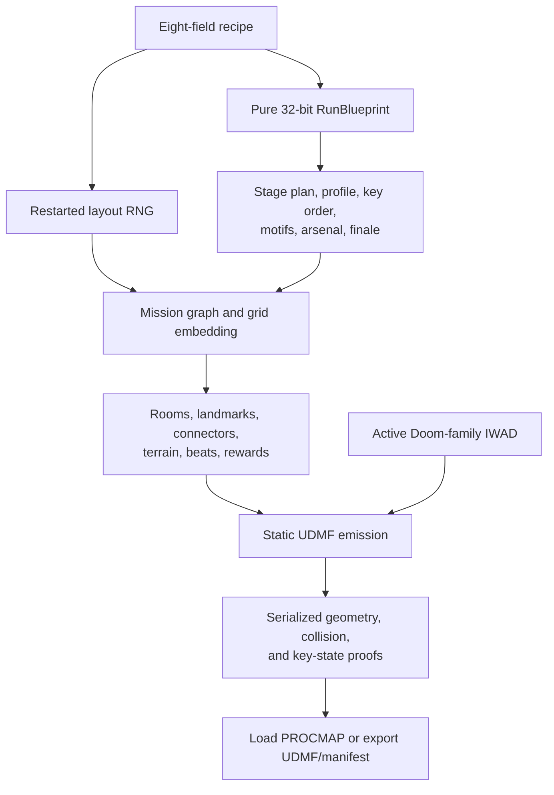

# Procedural Map Generation

> **Living Document** — This page is updated whenever the procedural generator is modified. Last updated: 2026-10-07.

BiasedDoom includes a runtime procedural dungeon generator that synthesizes complete UDMF maps in memory. Maps are generated on demand when the engine loads the special map name `PROCMAP` (or any name starting with `PROC`). No WAD/PK3 editing is required.

> **Scope TODO (intentionally deferred)** — This release supports only Doom and
> Doom II IWAD families. Heretic and Hexen procedural generation will not be
> implemented in this version: both need dedicated actor, inventory, key,
> texture, and map-action grammars. Other non-Doom families are likewise
> rejected clearly instead of receiving incompatible Doom content.

## Table of Contents

- [Quick Start](#quick-start)
- [Current Generation Pipeline](#current-generation-pipeline)
- [Planning Versus Realization](#planning-versus-realization)
- [Compatibility, Determinism, and Savegames](#compatibility-determinism-and-savegames)
- [Cooperative and Network Runs](#cooperative-and-network-runs)
- [Console Commands](#console-commands)
- [CVars](#cvars)
- [ZScript API](#zscript-api)
- [Algorithm Overview](#algorithm-overview)
- [Generated Map Structure](#generated-map-structure)
- [Architecture & Source Files](#architecture--source-files)
- [Testing](#testing)
- [Changelog](#changelog)

---

## Quick Start

### From the main menu

Choose **Procedural Game** from Doom's main menu. The setup screen contains every generation control:

- **Seed** — an exact signed integer. Reusing the same recipe rebuilds the
  same map within one engine build and active Doom game-data context (including
  the IWAD family).
- **Randomize Seed** — chooses and displays a new positive seed without starting immediately.
- **Theme** — Techbase, Hell, Industrial, Gothic, or Corrupted Tech.
- **IWAD-aware content** — Ultimate Doom receives its legal weapon, monster,
  prop, and texture vocabulary; Doom II may additionally use its Super Shotgun,
  MegaSphere, expanded bestiary, lamps, and `SPCDOOR` variants. The active IWAD
  is part of the generated-content contract, so an unavailable Doom II item
  always falls back to a stock Doom equivalent.
- **Generation Difficulty** — five encounter-pressure bands from Light Resistance to Nightmare.
- **Map Size** — an integer slider from 1 (compact) through 160 (absurd). The largest values intentionally trade generation/load time for extremely long routes and thousands of sectors. Sizes above 40 spread growth across both axes and center the emitted footprint to preserve a broad coordinate safety margin.
- **Layout Shape** — Directed keeps a focused critical route with few side limbs and loops; Balanced is the default; Exploratory lengthens the route and substantially increases optional branches and same-stage circulation.
- **Verticality** — At size 3+, Gentle uses a profile-derived stair hall,
  terrace overlook, or bridge approach; Varied plans a positive/negative
  dogleg pair; Dramatic plans a highland or basin. The planner retries a
  different protected chain when possible, but omits an unplaceable elevation
  beat rather than compromising clearance or failing the map. A constrained
  dogleg can also safely realize as a stair hall. At size 3–4 its
  main-route terrain target is a 128–192-unit landform; at size 5+ it targets
  192–320 units and plans an optional district at the opposite altitude.
  Every emitted elevation transition is an explicit 8-unit stair run with no
  single walking transition over 64 units; pads, doors, keys, switches, and
  exits stay level. The manifest distinguishes the requested terrain intent
  from the realized route.
- **Architecture Detail** — Sparse restrains landmark growth, interactive structures, trim, and props; Detailed is the default; Lavish expands landmarks and adds more reveal caches, perches, lifts, architectural trim, and collision-checked decoration.
- **Outdoor Spaces** — Enclosed keeps nearly all rooms roofed, Mixed alternates interior and courtyard beats, and Open-Air turns many eligible landmarks into sky spaces. The finale remains a readable outdoor landmark in every mode.
- **Run Blueprint** — every recipe automatically derives an Expedition, Assault, Infiltration, Circuit, or Siege run identity. It changes route direction, key order, branch/loop emphasis, combat beats, feature motifs, arsenal track, rewards, and finale without adding a selector or archived setting. The generated map shows its profile and one-line briefing together once on a fresh load.
- **Companion Bots** — configure the shared friendly co-op squad in
  **Options → Gameplay or Multiplayer → Companion Bots** before a run. The
  Procedural Game screen deliberately has no separate companion setup, so it
  cannot create a second squad; the same central controls are available for
  every ordinary map. They are owned by local play's settings controller or
  the network host and share eight native co-op slots with human players. See
  [Companion bots](companion-bots.md) for capacity, commands, key behavior,
  and host-transfer details.
- **Generate & Play** — starts a local `PROCMAP` run with the displayed
  settings, or begins a host-authored transfer when the settings controller
  uses it in a live cooperative session.
- **New Random Map** — chooses a new seed and starts it in one action.
- **Next Random Run (Same Setup)** — after you exit a procedural map through
  its normal or secret exit,
  starts a fresh local run, or a host-authored shared run when invoked by the
  settings controller in a live co-op session, from that completed map's theme,
  difficulty, size, and style settings while choosing a guaranteed-different
  seed. It is a quick endless-play loop, not a savegame/hub shortcut: a local
  run resets inventory and world state exactly as **Generate & Play** does, and
  saves still restore their archived map unchanged.
- **Restore Defaults** — returns to seed `0`, Techbase, Classic Doom difficulty, size `3`, and the Balanced/Varied/Detailed/Mixed style defaults.

All eight settings are archived, so the setup survives a restart. The blueprint is a pure result of those settings, not an additional saved control. The entry is restored after mod MENUDEF processing, remains present in classic and localized text-only layouts, and oversized replacement main menus scroll with the wheel, arrows, Page Up/Down, Home, and End.

Procedural savegames are self-contained. A save stores the complete eight-field recipe for diagnostics and the exact generated UDMF used by that session. Loading therefore restores the same base geometry and serialized world state even if the current procedural CVars differ or a later engine version changes the generator. Saves created before the four style controls existed load those missing fields as their neutral value (`1`).

### From the console (in-game)

Open the console (default key is `` ` ``) and type:

```
procmap          // local generation, or host-authoritative co-op transfer
map PROCMAP      // local load only; network peers require the host archive
```

In a live network game, only the host/settings controller may use `procmap`.
It first creates one exact UDMF archive, then changes maps only after every
peer has validated and acknowledged that archive. A direct `map PROCMAP`
request is deliberately rejected on a network peer because it would bypass the
archive hand-off.

### From the Linux terminal

All examples assume your binary is at `./build/biaseddoom` and IWAD is at `~/.config/biaseddoom/doom2.wad`. Adjust paths as needed.

```bash
# --- Basic: load with default CVars ---
./build/biaseddoom -iwad ~/.config/biaseddoom/doom2.wad +procmap

# --- Set CVars on the command line, then load ---
./build/biaseddoom -iwad ~/.config/biaseddoom/doom2.wad \
    +procgen_seed 42 \
    +procgen_theme hell \
    +procgen_difficulty 5 \
    +procgen_size 4 \
	+procgen_layout 2 \
	+procgen_verticality 2 \
	+procgen_detail 2 \
	+procgen_outdoors 2 \
    +procmap

# --- Same thing, shorter (procmap accepts seed override) ---
./build/biaseddoom -iwad ~/.config/biaseddoom/doom2.wad \
    +procgen_theme hell \
    +procgen_difficulty 5 \
    +procgen_size 4 \
    +procmap 42

# --- Use map command directly (CVars must be set first) ---
./build/biaseddoom -iwad ~/.config/biaseddoom/doom2.wad \
    +procgen_seed 12345 \
    +procgen_theme techbase \
    +procgen_difficulty 3 \
    +procgen_size 3 \
    +map PROCMAP

# --- Dump UDMF to disk for inspection (no GUI needed) ---
./build/biaseddoom -iwad ~/.config/biaseddoom/doom2.wad \
    +dumpprocudmf 42 techbase 3 4 \
    +quit

# --- Full autonomous non-interactive export (no sound, no GUI) ---
./build/biaseddoom -nosound -nomusic -nogui \
    -iwad ~/.config/biaseddoom/doom2.wad \
    +dumpprocudmf 99 hell 5 5 \
    +quit

# --- Batch: generate 10 maps with different seeds ---
for seed in {1..10}; do
    ./build/biaseddoom -nosound -nomusic -nogui \
        -iwad ~/.config/biaseddoom/doom2.wad \
        +dumpprocudmf "$seed" techbase 3 3 \
        +quit >/dev/null 2>&1
    cp /tmp/procmap_test.udmf "/tmp/procmap_seed_${seed}.udmf"
    echo "Generated /tmp/procmap_seed_${seed}.udmf"
done
```

### Parameters

| Parameter | Meaning | Range |
|-----------|---------|-------|
| `seed` | RNG seed for deterministic generation | any `int` |
| `theme` | Visual theme | `techbase`, `hell`, `industrial`, `gothic`, `corrupted`, or default |
| `difficulty` | Enemy/item density | `1`–`5` |
| `size` | Map scale and progression depth | `1`–`160` |
| `layout` | Route and optional-topology density | `0` Directed, `1` Balanced, `2` Exploratory |
| `verticality` | Planned terrain field and stair cadence | `0` Gentle, `1` Varied, `2` Dramatic |
| `detail` | Landmark, interactive-feature, trim, and prop density | `0` Sparse, `1` Detailed, `2` Lavish |
| `outdoors` | Eligible sky-courtyard cadence | `0` Enclosed, `1` Mixed, `2` Open-Air |

The C++ and ZScript setters clamp numeric inputs to these ranges. Theme names
are normalized to lowercase and unknown values safely become `techbase`.

---

## Current Generation Pipeline

This is the canonical description of the shipping generator. The longer
[Algorithm Overview](#algorithm-overview) below explains individual systems in
more depth; historical benchmark sections do not define current behavior.



### 1. Recipe and run identity

The complete player-facing recipe is the archived tuple
`seed`, `theme`, `difficulty`, `size`, `layout`, `verticality`, `detail`, and
`outdoors`. The setters normalize those values; a fresh `Generate()` then
clears all realization state, rebuilds a pure 32-bit hash from the tuple, and
restarts its shared layout RNG from the seed. The pure hash is deliberately
separate from the mutable layout RNG: inspecting the profile or adding a
blueprint field does not shift later room, monster, or geometry draws.

The hash creates an automatic `RunBlueprint`. It chooses one of five profiles
(Expedition, Assault, Infiltration, Circuit, or Siege), a cardinal route
orientation, a blue/red/yellow key permutation, two feature motifs on normal
maps or three at size 5+, an arsenal track, a finale card, bounded stage
weights, and terrain/vertical-route intents. It also plans two macro stages at
sizes 1–2, three at sizes 3–4, and four at size 5+. The blueprint is visible
through `procmap`, `GetRunProfile()`, `GetRunBriefing()`, and
`dumpprocmanifest`, but it is not a selectable profile or saved CVar.
The active IWAD is deliberately an emission context rather than a blueprint
hash input: it changes legal resources, texture metrics, and the final UDMF,
not the profile selected from the eight-field recipe.

### 2. Mission graph before geometry

The coarse grid is only an embedding surface. The generator first creates a
private randomized spanning-tree scaffold, then selects a critical route that
travels in the blueprint's chosen direction. It adds optional limbs,
landmarks, same-stage loops, and route variation according to the requested
layout style and the profile. Only accepted graph cells become map space; it
does not serialize a filled rectangular grid.

Progression is planned on that graph:

- Each required key is placed before its matching keyed boundary, usually on a
  dedicated side limb.
- A progression boundary has exactly one keyed crossing. All extra loops stay
  in one lock stage, so they improve circulation but cannot bypass a key.
- Each stage requests one feasible macro shape—Spine, Fork-Rejoin, Ring,
  Switchback, or Courtyard-Spokes—and a district role/landmark. A compact or
  constrained embedding deterministically falls back to a safe spine rather
  than violating the gate rule.
- Planned room beats and geometry-qualified encounter cards give the route
  pauses, skirmishes, crossfires, pincers, ambushes, cache challenges, holding
  lines, and set pieces without runtime spawning or an adaptive director.

### 3. Spatial composition and terrain

Compatible cells merge only within the same lock stage. The room pass assigns
each result a role, a theme-led footprint grammar, a material family, a floor
altitude, clear height, encounter/recovery plan, and optional landmark status.
It uses asymmetric octagons, tapered bays, apses, stepped compounds, courtyard
cuts, and fractured wedges where they fit; critical thresholds retain a safe
shell. Eligible rectangular compounds can serialize as one shared exterior
envelope, while complex contours use a conservative emitted shell with an
explicit proof witness.

Every graph edge also receives a physical connector contract before UDMF is
written. Narrow 96×48 links are restricted to deep optional branches.
Required travel, locks, and stairs are at least Standard (128×64); routine
landmark transitions can become Gallery (176×96), and major landmarks/finales
can become Grand (224×128). Those dimensions describe player clearance, not
the dimensions of the door artwork.

Verticality is a graph field, not a repeating distance formula. Critical
start/key/exit pads, manual switches, normal doors, keyed doors, and their
approaches stay level. Required changes are emitted as real 8-unit stair
chains, with no single walking change greater than 64 units. At normal sizes,
the blueprint plans one Gentle route stair beat, a Varied ascent/descent pair,
or three Dramatic beats plus a highland/basin. Dramatic runs target 128–192
units at sizes 3–4; at size 5+ the target is 192–320 units and the plan also
targets an optional district at the opposite altitude. The manifest reports both
requested and realized vertical intent. If an intended scenic chain cannot fit
the protected route, the generator tries another eligible chain and then omits
that planned connector or optional scenery before it would compromise
progression or access. A manifest's realized fields, rather than its terrain
target, describe the vertical route actually emitted.

### 4. Static emission, visual grammar, and combat economy

`BuildUDMF()` emits closed ZDoom-namespace sectors, vertices, sidedefs,
linedefs, and things. Theme-local material families coordinate walls, floors,
ceilings, trims, corridors, stairs, and landmark accents across each district.
The active IWAD supplies the logical width and height used for texture
transforms: continuous walls use world phase, architectural runs use a shared
run phase, and isolated trim is centered deliberately. Each sidedef part has
its own transform so two-sided height boundaries and reversed faces remain
aligned.

Doors are recessed 16-unit moving slabs inside protected approaches. A compact
door face is a centered crop; if the physical aperture is wider than the
native door art, the art repeats at native horizontal scale with a signed,
centered phase. In practical terms, the middle of a 176- or 224-unit door now
lands on the middle of a texture tile instead of exposing an arbitrary
left-anchored repeat. Front and back faces are independently aligned using the
active IWAD's metric, while tracks, keyed trims, and switch panels retain their
separate fitting contracts.

The content pass then emits only static, IWAD-legal things. The starting
shotgun and mandatory-route viability remain guaranteed. Ballistic,
Demolition, and Energy tracks change the timing of chaingun, rocket, plasma,
and optional armory choices; Doom II may add the Super Shotgun and MegaSphere,
while Ultimate Doom receives stock equivalents. Threat/recovery planning
prohibits more than two high-pressure main-route beats in a row, provides a
recovery or meaningful choice after major fights, and maintains emergency
ammo/health floors. Feature motifs can reserve watercourses, vertical
pressure, remote manual-switch caches, shrine/secret systems, and sightline
reconnaissance before decoration claims the space.

### 5. Accessibility is a release gate, not a decoration preference

Before props, pickups, and combat dressing are placed, the emitter reserves
collision-clear lanes for mandatory portals, both keyed-door approaches,
stairs, start/key/exit pads, required pickups, and manual switches. Solid props
use conservative radii and are rejected from locked transitions, one-cell
connectors, stair/door approaches, landmark lanes, and any candidate that
would create a player-blocking pinch. The fallback policy is intentionally
one-way: drop optional decoration or features before compromising a route.

After serialization, a collision-aware navigation proof uses the actual
sectors, anchors, and clear corridors—not just logical grid adjacency. It
proves a route from the start through every required key and both sides of each
keyed door to the exit; it also checks ordinary rooms and non-secret optional
rewards in their valid key state. Manual switch caches are proved unreachable
until their explicit `playeruse` action opens the tagged cache, then reachable
afterward. A separate symbolic key-inventory solver validates the same
start → keys → matching gates → exit sequence. Failed geometry, clearance, or
key-state proof rejects the generation rather than loading an inaccessible
map.

### 6. Load, replay, and inspection

For a fresh local run, `P_OpenProceduralMapData()` owns runtime generation when
the engine loads `PROCMAP` (or a `PROC...` map name). It reconfigures the
singleton from the archived CVars immediately before generating, then exposes
the resulting text as an in-memory `TEXTMAP` to the ordinary map loader and
node builder. A shared run takes the other path: its host creates and stages
the archive before the map change, and every participant consumes those exact
verified bytes. A fresh load shows the profile and briefing once; savegame and
hub restoration reuse the archived UDMF and intentionally suppress that repeat
notification.

Exiting a real procedural map records its recipe in runtime-only state. The
Procedural Game menu's **Next Random Run (Same Setup)** action (and
`procmap_next`) copies the seven non-seed fields and chooses a
guaranteed-different positive seed. It starts a fresh local game in local play;
in a live cooperative session, the host/settings controller instead prepares a
new authoritative archive transfer. It deliberately does not modify a savegame
or a hub restoration. `dumpprocudmf` exports the emitted TEXTMAP;
`dumpprocmanifest` exports the recipe-derived plan plus realized geometry,
material, resource, visual, and accessibility witnesses used by tests and
external tooling.

## Planning Versus Realization

The generator deliberately distinguishes what the recipe requests from what a
particular grid and serialized map can safely realize. That distinction keeps a
seed deterministic without letting a decorative goal make a run invalid.

| Layer | Deterministic decision | Safe realization rule |
|---|---|---|
| Run blueprint | Profile, direction, key order, stage weights/shapes, motifs, arsenal, finale, and terrain intent | Derived only from the recipe hash; it never consumes layout RNG. |
| Mission graph | Critical route, key limbs, lock stages, loops, landmark candidates, and vertical anchors | A stage may fall back to a Spine; detours stay within their lock stage and cannot bypass a keyed crossing. |
| Spatial composition | Room mergers, footprint/material family, connector profile, floor field, cards, and recovery | Protected pads, door approaches, and stair chains take priority over organic contours, props, and optional features. |
| UDMF emission | Concrete sectors, portals, doors, stairs, surfaces, things, and texture transforms | A complex footprint may use a safe shell, a tight planned dogleg may become a stair hall, and an unplaceable planned elevation connector may be omitted; no fallback may narrow required travel. |
| Post-serialization proof | Actual collision lanes, anchors, key states, switch states, texture witnesses, and geometry | Generation fails instead of loading an unproven route; optional scenery is dropped first. |

`dumpprocmanifest` makes both sides inspectable: requested and realized stage
shape, landmark, footprint, vertical intent, connector, and proof fields are
reported separately where a safe fallback is possible. Treat the realized
fields as the description of the map that was actually emitted.

## Compatibility, Determinism, and Savegames

Procedural generation currently supports only the Doom-family `GAME_Doom`
path: Doom/Ultimate Doom and Doom II IWADs. The active map family is recorded
as `iwad_roster` (`doom1` or `doom2`) in the manifest. Doom II-only actors,
weapons, powerups, lamps, and `SPCDOOR` art are gated by that roster, with
stock Doom replacements at the final thing-emission boundary as a defensive
fallback. Heretic and Hexen support is intentionally deferred for this
release; all non-Doom game families fail clearly rather than receiving
incompatible Doom content.

Within one engine build and active Doom game-data context (including the IWAD
family), the same eight-field recipe produces byte-identical UDMF and manifest
output. A later generator release may intentionally change an old seed; this is
why a procedural savegame archives both the complete recipe and the exact
generated UDMF. Loading such a save restores that historical base map even when
current CVars—or the generator itself—have changed.

## Cooperative and Network Runs

Companion bots work on all ordinary maps and on Doom-family procedural maps.
They occupy normal cooperative player slots. A nonzero companion target enables
the server's `sv_coopsharekeys` rule, so a key collected by any human or
companion serves the whole group; a companion never bypasses a lock or receives
a private procedural key path. Generated maps reserve protected P1–P8 pads in
the start landmark; P1 remains the canonical progression start and the other
native starts give human players and companions clear placement. Participant
and companion count never enter the recipe, so they cannot change a generated
map's UDMF or manifest. The schema-1 manifest records this proof at
`accessibility.collision_navigation.cooperative_starts`, including the eight
native slots, canonical P1 origin, actual minimum separation, and each start's
thing, landmark, position, and clear-pad evidence.

In a network game, only the host/settings controller can begin a procedural
run. It generates the recipe exactly once, transfers a checksummed embedded
UDMF archive to every peer, and waits for each peer to validate, stage, and
acknowledge that archive before the ordinary map change. Clients do not
regenerate from a shared seed, so there is no cross-release shared-seed
compatibility promise. Every peer must use compatible Doom-family game data and
the same procedural roster context (Ultimate Doom or Doom II); the host rejects
an IWAD/roster mismatch rather than converting Doom II-only content for another
IWAD. A shared procedural session permits at most eight human participants,
before companion capacity is considered. Join-in-progress is unavailable during
that transfer. Before the final map-change event is committed, a validation
failure, cancellation, or timeout keeps everyone on the current map. The host
starts it from the existing live cooperative session; it finishes before the
standard map change and is unavailable in deathmatch.

After a normal network host handoff, the new host/settings controller may
start a later procedural run and manage the companion squad. A handoff during
an active transfer cancels that transfer safely rather than allowing competing
map changes. Savegames remain self-contained because they retain the exact
archived UDMF.

---

## Console Commands

### `procmap [seed|random]`

Starts a procedural run from the current CVars. In local play it loads the map
through the ordinary new-game path. In a live cooperative network game, the
host/settings controller first generates a single archive and transfers it to
the connected peers; the normal map change follows only after every peer has
validated and acknowledged the archive.

- If `seed` is provided, it overrides `procgen_seed` for this invocation. `random` chooses a new positive seed first.
- For a local fresh run, generation happens inside `P_OpenProceduralMapData()`
  when the engine loads `PROCMAP`. A shared run instead builds one archive on
  the host before the map change; peers consume that verified archive rather
  than generating a second copy.
- The console prints the selected run profile and briefing. A fresh map load shows them together once as a mid-screen notification; savegame and hub restoration deliberately do not repeat it.
- A network client cannot start, edit, or locally regenerate a shared run. It
  accepts only the host's verified archive; shared runs require a live,
  non-recording co-op game and are unavailable in deathmatch.

### `procmap_next`

After completing a procedural map through its normal or secret exit, prepares
and starts the next endless-play run. It copies the completed map's theme,
difficulty, size, layout, verticality, detail, and outdoor settings, then
chooses a different positive seed. In local play it starts a fresh game; in a
live co-op session the host/settings controller uses the same host-authored
archive-transfer path as `procmap`. The action never alters a save or hub
restoration. Before a procedural map has been completed, it safely explains
that no completed recipe is available.

### Menu helper commands

- `procmap_randomize_seed` updates the archived seed without launching a map.
- `procmap_restore_defaults` restores every procedural CVar to its menu default.
- `procmap_next` is the menu's post-completion **Next Random Run (Same
  Setup)** action; it preserves the last completed recipe except for its new
  seed.
- Startup `+procmap` invocations enter the engine's normal autostart path; live
  menu/console invocations defer the appropriate local or host-authoritative
  new-game path on the next tick.

### Shared-run transfer controls

`procmap_transfer_status` reports the active host transfer or client receive
state, including chunk progress and whether a client archive has been verified.
`procmap_cancel` safely cancels an active hand-off before its final map-change
event has been committed. A cancellation, checksum failure, roster change, or
timeout then leaves the current map in place; clients do not fall back to
locally regenerating `PROCMAP`.

### `dumpprocudmf <seed> [theme] [difficulty] [size] [layout] [verticality] [detail] [outdoors] [output]`

Generates a map and writes the raw UDMF TEXTMAP to `/tmp/procmap_test.udmf`.
The optional final argument selects a different output path. Useful for
debugging and inspection. Omitted positional arguments use the command's
fixed diagnostic defaults (`0`, `techbase`, difficulty `3`, size `3`, and
style values `1`), not the current procedural CVars; pass all eight recipe
fields when reproducing an active menu setup exactly.

Example:
```
dumpprocudmf 42 hell 5 5 2 2 2 2
```

### `dumpprocmanifest <seed> [theme] [difficulty] [size] [layout] [verticality] [detail] [outdoors] [output]`

Generates the same recipe and writes its run-plan manifest to
`/tmp/procmap_manifest.json` by default. The optional final argument selects a
different output path. As with `dumpprocudmf`, omitted positional arguments
use the fixed diagnostic defaults rather than current CVars. The JSON schema is currently `1` and records the
difficulty, active `iwad_roster`, profile, briefing, route orientation, shuffled key order, feature
motifs, arsenal track, finale card, post-emission accessibility proof, and the
planned/realized macro-stage counts. Each stage records requested/realized
shape, landmark archetype, district role, `material_family`, `elevation_role`,
vertical intent, planned `vertical_rise`, realized `realized_vertical_rise`,
and gate timing; the serialized stage count and keyed-door approaches reflect
the realized route, while `key_order` remains the full recipe-derived color
permutation. Every generated room records its corresponding stage plus beat,
encounter card, threat/recovery budget, weapon, ammo type/count, reward,
armory plan, realized `manual_interaction`, requested and realized footprint
grammar, unified-envelope/sector/bounds evidence when applicable, material
family, `floor_z`, clear height, and contour metrics. The top-level
`connections` list records each realized source/target, route role, profile,
clear width, depth, physical-door kind/clear width, native door-art dimensions,
rise, stair-chain identity, and alignment group. `visual_proof` summarizes
the alignment, contour geometry, connector-clearance, and elevation checks.
Its additive `alignment` object records the active-IWAD logical texture metric
cache plus bounded final-sidedef witnesses for world joins, two-sided height
bands, and architectural stair/portal runs. Those witnesses expose the final
per-part offsets, scales, phase origin, and vertical anchoring without changing
the schema number or becoming generator input.
For Dramatic runs, `main_route_elevation_target` and
`optional_elevation_target` retain the recipe's large-scale terrain intent;
the realized room floors and `visual_proof` make any clearance-safe fallback
inspectable. Its schema-1 `accessibility.collision_navigation` summary adds
the collision capsule accounting used by the final proof: pad/corridor
reservation counts, only those emitted connectors that cleared the physical
check, the valid-key-state edge count, and bounded UDMF witnesses for the
start, keys, exit, both faces of each keyed door, and each explicit switch.
It also exports every non-unified room-merge lane with its exact collision
capsules; only an actually emitted unified envelope may omit that internal
lane. Switch-cache witnesses name the player-use linedef, both physical faces
of its closed tagged door, and the tagged reward pads, proving the reward is
unreachable before use and reachable only after that explicit action. The
solver traverses only proven emitted corridors, never raw coarse-grid
adjacency. These witnesses are stable enough for tooling to cross-check a
separately dumped UDMF without exposing every internal sector.

```text
dumpprocmanifest 42 hell 5 5 2 2 2 2 /tmp/hell-run.json
```

---

## CVars

All CVars are archived (`CVAR_ARCHIVE`), so they persist across sessions.

| CVar | Type | Default | Description |
|------|------|---------|-------------|
| `procgen_seed` | `int` | `0` | RNG seed. The same recipe produces the same map and Run Blueprint within one engine build and active Doom game-data/IWAD context. |
| `procgen_theme` | `string` | `"techbase"` | Visual theme: `"techbase"`, `"hell"`, `"industrial"`, `"gothic"`, or `"corrupted"`. Unknown names safely fall back to Techbase. |
| `procgen_difficulty` | `int` | `3` | Difficulty level (1–5). Affects enemy count, enemy tiers, and boss selection. |
| `procgen_size` | `int` | `3` | Map size (1–160). Controls route length, canvas dimensions, keys, branches, landmarks, and encounter budget. Values above 20 are intentionally extreme. |
| `procgen_layout` | `int` | `1` | Layout shape (`0` Directed, `1` Balanced, `2` Exploratory). Changes route target, branch count/length, loop budget, and directional embedding bias. |
| `procgen_verticality` | `int` | `1` | Vertical style (`0` Gentle, `1` Varied, `2` Dramatic). Changes the graph-planned terrain field, landmark altitude, and stair-chain budget while preserving stair reachability. |
| `procgen_detail` | `int` | `1` | Architecture density (`0` Sparse, `1` Detailed, `2` Lavish). Changes landmark footprint, interactive reveals, perches, lifts, chamfer trim, and props. |
| `procgen_outdoors` | `int` | `1` | Outdoor cadence (`0` Enclosed, `1` Mixed, `2` Open-Air). Changes how many eligible arenas, hubs, and route halls use sky ceilings. |

### Setting CVars

In the console:

```
procgen_seed 42
procgen_theme hell
procgen_difficulty 5
procgen_size 4
procgen_layout 2
procgen_verticality 2
procgen_detail 2
procgen_outdoors 2
```

From the Linux terminal (prepend `+` to each CVar):

```bash
./build/biaseddoom -iwad ~/.config/biaseddoom/doom2.wad \
    +procgen_seed 42 \
    +procgen_theme hell \
    +procgen_difficulty 5 \
    +procgen_size 4 \
	+procgen_layout 2 \
	+procgen_verticality 2 \
	+procgen_detail 2 \
	+procgen_outdoors 2
```

**Important:** CVars are archived (`CVAR_ARCHIVE`), so once you set them they persist across game restarts. To reset to defaults:

```
reset procgen_seed
reset procgen_theme
reset procgen_difficulty
reset procgen_size
reset procgen_layout
reset procgen_verticality
reset procgen_detail
reset procgen_outdoors
```

---

## ZScript API

Mods can trigger procedural generation from ZScript via the `ProceduralMapGenerator` class.

```zscript
class MyEventHandler : EventHandler
{
    override void WorldLoaded(WorldEvent e)
    {
        // Configure and generate
        ProceduralMapGenerator.SetSeed(12345);
        ProceduralMapGenerator.SetTheme("techbase");
        ProceduralMapGenerator.SetDifficulty(3);
        ProceduralMapGenerator.SetSize(4);
		ProceduralMapGenerator.SetLayout(2);
		ProceduralMapGenerator.SetVerticality(2);
		ProceduralMapGenerator.SetDetail(2);
		ProceduralMapGenerator.SetOutdoors(2);

        int ok = ProceduralMapGenerator.Generate();
        if (!ok)
        {
            console.printf("Generation failed: %s", ProceduralMapGenerator.GetLastError());
        }

        // Read-only, recipe-derived run identity. These calls do not advance
        // generation RNG or change the generated map.
        console.printf("%s — %s",
            ProceduralMapGenerator.GetRunProfile(),
            ProceduralMapGenerator.GetRunBriefing());
    }
}
```

### `GenerateAndLoad` (legacy one-shot generator)

```zscript
int ok = ProceduralMapGenerator.GenerateAndLoad(
    42,      // seed
    "hell",  // theme
    5,       // difficulty
    4        // size
);
```

Despite its historical name, this native currently configures the singleton
and calls `Generate()` only; it does **not** transition to `PROCMAP`. It also
resets Layout, Verticality, Detail, and Outdoors to their neutral value (`1`).
For a styled runtime map, call the individual setters, call `Generate()` if a
preflight result is needed, then use the normal `procmap`/`map PROCMAP` loading
path. It returns `1` on successful UDMF generation and `0` on failure.

`GetRunProfile()` and `GetRunBriefing()` are read-only static accessors. They
derive the same automatic blueprint from the current recipe before generation,
and report the generated run afterward. Mods cannot select or override a
profile through this API.

---

## Algorithm Overview

Generation is **mission-graph first**. The grid is an embedding surface, not a mandate to fill the map with square rooms. This keeps progression provable while allowing room scale and silhouette to vary.

The design targets were measured from representative maps in `doom.wad` and `doom2.wad`: directional footprints, 10–35% diagonal linedefs, restrained doors, distinct light/height zones, optional dead-end rewards, and encounter counts that grow with the map rather than with every decorative sector.

The themes are separate architectural grammars:

| Theme | Geometry and pacing | Light/material identity | Signature structures |
|-------|---------------------|-------------------------|----------------------|
| Techbase | Airlocks, command courts, reactor wells, and disciplined angled bays | Cool blue-white light; coordinated computer, support, and clean-metal families | Computer trim, tech columns, lamps, controlled courtyards |
| Hell | Blood chapels, broken wedges, ritual pits, and chasm bridges | Warm red-orange light; stone, marble, vine, wood, and hot-rock families | Torch courts, ritual shrines, elevated firebases |
| Industrial | Loading bays, refinery switchbacks, and foundry bastions | Warm desaturated light; metal, support, machinery, and worn-floor families | Service doglegs, machinery columns/barrels, remote supplies |
| Gothic | Gatehouses, naves, apses, cloisters, and throne courts | Cool violet light; marble, wood, green stone, and vine families | Tall nave arenas, candelabra, terraces, elevated perches |
| Corrupted Tech | Containment halls, breach terraces, fractured chambers, and hell-core finales | Cool tech light transitions through mixed gray to hot red; coordinated tech/infernal families | Phase-dependent tech/organic trim, corrupted lamps/torches, hybrid bastions |

Theme rules and menu settings compose. For example, Enclosed Hell still retains its mandatory outdoor finale but has far fewer courtyards than Open-Air Hell; Dramatic Gothic keeps its cathedral clearance on top of its highland/basin terrain field.

### Automatic Run Blueprints

Before the layout RNG is touched, a pure 32-bit hash of the eight-field recipe
chooses a `RunBlueprint`. It never consumes the shared layout stream, so
adding or inspecting blueprint data cannot perturb later geometry draws. The
choice is automatic—there is no `procgen_profile` CVar, menu setting, or
legacy-generation switch.

| Profile | Primary gameplay identity |
|---|---|
| Expedition | Longer exploration routes, optional caches, and late landmark pressure |
| Assault | Shorter route, earlier escalating pressure, and recovery between set pieces |
| Infiltration | Guarded districts, ambushes, shortcuts, and hidden rewards |
| Circuit | Same-stage loops and cross-routes that make each key a route choice |
| Siege | Fortified arenas, deliberate holds, recovery caches, and a hard finale |

The blueprint also selects an eastbound, westbound, northbound, or southbound
route orientation; a non-fixed permutation of blue, red, and yellow keys; two
motifs on normal maps and three at size 5+; Ballistic, Demolition, or Energy
arsenal pacing; and Duel, Siege, Gauntlet, or Fortress finale language. It
then divides the run into two to four visible macro stages. Each stage records
a requested and safely realized shape (`spine`, `fork_rejoin`, `ring`,
`switchback`, or `courtyard_spokes`), a district role, a landmark archetype,
and a planned vertical-route intent. The profile and briefing are
deliberately visible from `procmap`, the ZScript accessors, and
`dumpprocmanifest`, so a run's identity can be inspected rather than inferred
from a seed.

### 1. Route Embedding

- Through size 40, canvas dimensions are `W = 8 + 2 × size`, `H = 7 + size`. Above 40, each additional size step transfers one unit of horizontal growth into height: `W = 8 + 2 × size - (size - 40)`, `H = 7 + size + (size - 40)`. The size-160 canvas is 208×287, preserving a broad coordinate safety margin rather than pressing a very long strip against one axis. Difficulty changes landmark cell budgets rather than route length.
- A randomized DFS spanning tree is created privately as an embedding scaffold.
- The chosen critical path starts near one edge and favors the opposite edge selected by the blueprint's cardinal orientation. Balanced targets `9 + 4 × size` cells; Directed and Exploratory scale that target, while the blueprint independently varies route length, branch concentration, loop quota, and hub/arena timing inside safe bounds.
- Only the selected path, planned branches, and landmark footprints become map geometry. The old dense grid carpet is not emitted.

### 2. Mission Graph and Progression

- Sizes 1–2 plan one key, sizes 3–4 plan two, and size 5+ plans three when route length permits.
- Each key occupies a dedicated side branch before its corresponding gate.
- Gates own exactly one directed boundary. A locked room no longer turns every one of its edges into duplicate locked doors.
- Optional branches are distributed along the critical path and avoid touching it away from their anchor.
- Extra loops are added only within the same lock stage, so circulation cannot bypass key progression. The first loop pass favors connections separated by at least three progression ranks, creating longer foldbacks and revisiting earlier regions rather than only joining neighboring branches.
- Every retained cell records its lock stage. Before room composition, the generator audits every connection and requires each stage cut to contain exactly one crossing owned by the matching keyed edge. Room merging is also restricted to a single stage, and UDMF emission repeats the cross-stage lock check before creating a portal or door.

The blueprint shuffles the three stock key colors—blue (`type` 5), red (`type`
13), and yellow (`type` 6)—before placing key limbs and gates. Locked portals
still use the normal `Door_Raise` action (special 12) plus the appropriate
UDMF `locknumber`; this follows the same manual-door path as stock ZDoom maps.

### 3. Landmark and Room Composition

The start, hubs, arenas, key shrines, and exit are expanded into multi-cell landmarks. Blueprint timing replaces fixed one-third/two-thirds hub and arena beats, while arena, shrine, and finale footprints still grow with generation difficulty to provide more lateral movement as projectile pressure and monster mass increase. A bounded room compositor then merges compatible cells according to their role:

- landmarks become broad, but vary between concentrated stages and room-spanning courts;
- ordinary main-route cells mix compact chambers, elongated two-cell rooms, and larger composed halls instead of converging on one module size;
- deep branches remain visually denser and may use the 96×48 narrow connection profile, while mandatory travel, locks, and stair chains retain their wider protected profiles;
- locked gate cells remain isolated so their owning boundary cannot disappear inside a merged room.

Before growth, every room receives an explicit connector, small, medium, or major spatial class plus a deterministic footprint grammar: asymmetric octagon, tapered bay, apse, stepped compound, courtyard cut, or fractured wedge. The selected theme weights those grammars rather than merely changing wall art. Fully rectangular composed rooms that do not host a protected feature serialize as one true shared-sector exterior envelope; the emitter proves that no former same-room cell-face wall remains. Other compounds retain the conservative clipped-shell path, where bays, apses, angled cuts, and concave courts vary safe exterior faces. The manifest always distinguishes requested from realized grammar, falling back to `safe_shell` rather than weakening portal lanes or clearance reservations.

The planner remains integer-grid based, but serialization offsets each row and column by a seed-derived 0 or 16 units. Consecutive center gaps therefore alternate between 368, 384, and 400 units instead of exposing a perfect 384-unit drafting grid on the automap. Local per-face expansion, asymmetric corner cuts, non-45-degree shoulders, and room-owned contour grammar keep compound rooms from reading as repeated rectangles. Protected starts, locks, keys, and exits retain the clearances their progression geometry needs; ordinary routes carry the strongest scale and silhouette variation.

Every inter-room edge chooses one deterministic connection profile before geometry is emitted:

| Profile | Clear width × depth | Allowed use |
|---|---:|---|
| Narrow | 96×48 | Deep optional branch only |
| Standard | 128×64 | Required travel, keyed doors, and stair chains |
| Gallery | 176×96 | Routine main-route and landmark transitions |
| Grand | 224×128 | Arenas, major landmarks, and finales |

The reservation pass protects the full connection depth, stair chain, door approach, and landmark lane before props, pickups, or combat dressing are considered.

### 4. Visual Coherence

- Recipe-hashed material families are selected per theme-local district rather than from a topology-only wall sequence. Each family owns coordinated walls, floors, ceilings, trims, corridors, stairs, and landmark accents. District boundaries use deliberate architectural returns and trim transitions; bounded room-local variants prevent same-family rooms from becoming strip-randomized or repetitive.
- Neighboring rooms use broad material clusters keyed to their district, role, and family. Every continuous chamber perimeter keeps one coherent wall language. Accent/detail materials appear only at corners with depth, platforms, jambs, or reveal pavilions, and connector materials sit behind architectural returns so a texture never changes halfway through a flat wall.
- The elevation field is hash-planned over the room graph rather than derived from distance modulo a cadence. Door thresholds, start/key/exit pads, required switches, and both sides of a keyed door remain level. Realized Dramatic routes build their highland/basin through multiple exact 8-unit stair runs; no walkable connection rises or drops more than 64 units at once, and an infeasible scenic chain is replaced or omitted before it can fail the map.
- Ceiling height follows room role: compact connectors start at 144 units, general halls at 160, hubs at 192, arenas at 240, and exit chambers at 288.
- Lighting darkens through progression and on deep branches, while starts, keys, hubs, and exits receive readable highlights. Emission clamps every playable sector to at least 160 to prevent accidental black rooms.
- Every coarse chamber has bounded, independently varied corner cuts and shoulder slopes. The local offsets include non-45-degree diagonals, producing a substantial angled vocabulary without allowing perimeter shaping to cross into the void or disturb a portal.
- Wall alignment uses the logical display width and height of the active IWAD texture, with a role-safe fallback selected before transforms are calculated. Ordinary wall bands retain a continuous world phase; corridors, stairs, and landmark loops use an architectural-run phase; isolated trim and diagonal detail use a centered native-size phase. Top, middle, and bottom parts receive their own safe transforms, including reversed backs and height boundaries. Doors use a native-scale centered crop-or-repeat phase; switches retain the separate exact-fit single-panel contract.
- Large landmarks use support-textured corner cuts, role-specific floor pads, ceiling coffers, and small light accents rather than applying detail uniformly to every room.
- The exit is always an outdoor finale. The outdoor budget is `1 + size / 12`
  for Enclosed, `2 + size / 2` for Mixed, and `3 + size` for Open-Air, then
  receives theme adjustments (Hell/Gothic/Corrupted add opportunities;
  Industrial reduces them). After the exit consumes one slot, eligible arenas,
  hubs, and large main-route rooms are considered in that order. A compact
  Enclosed map may therefore contain only its outdoor finale, while larger
  Mixed/Open-Air maps develop a broader courtyard cadence.
- Techbase landmarks use lamps in Doom II and shared tech pillars/columns in Ultimate Doom. Hell and Gothic landmarks use progression-colored torches, key-colored shrine markers, candelabras, evil eyes, and torch trees. When a solid key-room marker would compromise a reserved route or interaction pad, the matching `DOORRED`/`DOORBLU`/`DOORYEL` keyed-door trim remains the color-readable landmark instead. When a solid Hell finale or outdoor marker cannot fit, a non-solid hanging infernal marker preserves the visual evidence. Visual dressing never overrides navigation clearance. Industrial adds denser machinery clutter, while Corrupted Tech changes its prop language with the architectural infection.
- Every ordinary room attempts one to three decorations and major landmarks attempt four to eight. Twelve wall/corner bays distribute them without forming a repetitive four-corner pattern. Solid decorations are rejected when they overlap an actor or pickup or enter the 112-unit approach rectangle around a portal, door, lift, full stair route, or manual switch panel. Shallow landmark tiers use a separate 40-unit exclusion so semantic shrine markers remain possible without occupying the route. The serialized validator also reserves player-turning clearance at starts, keys, the opening shotgun, and switch-use points. Combat rooms can add non-solid corpses without affecting collision.

### 5. Doors and Architectural Detail

- Locked doors are emitted only on their planned gate edge.
- Normal doors have a global budget and at most one door per room pair.
- Reward rooms and deep branches may request doors; random doors are intentionally rare.
- Doors are recessed 16-unit slabs centered inside static jambs. Every graph manual, keyed, or secret door owns a physical Standard-or-wider aperture (at least 128×64) and level approach sectors on both sides. The moving face may still use IWAD-native art—`DOOR1`/`DOOR3` are 64×72, `BIGDOOR1` is 128×96, `BIGDOOR6` is 128×112, the remaining `BIGDOOR`/marble profiles are 128×128, and Doom II Techbase/Industrial maps can use 64×128 `SPCDOOR` art—but that art is fitted independently and never dictates player clearance. Connector walls step behind 8-unit returns before reaching the jambs, making the material transition read as depth rather than a flat texture splice. Keyed doors remain readable through `DOORRED`, `DOORBLU`, or `DOORYEL` tracks from either side.
- Door faces remain pegged to the moving ceiling, while one-sided track walls use `dontpegbottom` and a world-aligned row offset. The slab moves; its tracks never do.
- Multi-cell starts and hubs can receive a centered 8-unit landmark platform. Arenas, key shrines, and exits use two concentric 8-unit tiers, producing a readable 16-unit stair dais instead of an abrupt curb.
- A size- and detail-scaled set of deep optional branches terminates in wall-aligned secret doors and real engine-counted `SECRET_MASK` (`0x0400`) sectors with health, armor, ammunition, and progression-aware powerups. Switch-operated opportunity caches also count as secrets once entered, regardless of whether their pre-opening cue is hidden, subtle, or prominent.
- Detail stays fully inside one known chamber, preventing feature sectors from leaking into the void around concave rooms.

### 6. Interactive Spaces, Traps, Fluids, and Height

- Broad rooms can contain switch-opened supply spaces whose closed tagged door is opened permanently by a real `SW1COMP` or `SW1GARG` wall switch using `Door_Open`. Each stock 64×128 switch is fitted to one centered 64-unit panel, surrounded by ordinary wall shoulders, and scaled vertically to appear exactly once. Every generated `Door_Open` is one-sided and `playeruse`; none uses `playercross`, so key collection and ordinary traversal never trigger an off-screen reveal. Selected switches are placed in a nearby room within the same lock stage, creating a remote opportunity without activating through a future key gate.
- Reveal architecture is selected from three families before wall emission reserves its host cell or wall face: a freestanding clipped pavilion, a framed wall-aligned alcove with structural piers, or a perimeter false-wall chamber extending into a proven-empty neighboring grid cell. False-wall chambers themselves vary among deep firing slits, broad shallow caches, dogleg annexes, and expanding vaults. Constrained rooms fall back deterministically to a feasible family, while maps with several opportunities deliberately mix families. Moving faces are 80, 64, or 96 units wide respectively. Their cue can be prominent, subtly framed, or texture-matched and automap-hidden; each reveal remains a manual ammunition/health cache. Ambushes remain ordinary geometry-qualified encounter cards, never key-pad triggers.
- Pre-emission fluid descriptors shape shallow animated liquids as central, trench, paired, or irregular reservoirs; whole flooded rooms; and straight, staggered, or right-angle multi-cell watercourses. One safe noncritical room of at least three cells is preferentially converted into a liquid floor with a dry chamfered island that retains the room's actors and rewards. Other macro systems use uneven multi-segment shorelines, 80-unit dry circulation bands, and 64-unit bridges or causeways, so the liquid divides or frames combat space instead of reading as an inserted floor decal. Starts, keys, exits, bosses, locks, secrets, reveals, perches, lifts, triggers, and mandatory passages remain protected. Techbase and Industrial use water/nukage, Hell uses blood/lava, Gothic mixes blood/water with occasional lava, and Corrupted Tech progresses from water/nukage toward blood/lava. Water and blood are harmless. Nukage deals 5 Slime damage every 32 tics; lava deals 5 Fire damage every 16 tics, ignores radiation-suit protection, and enables terrain damage effects. The descriptor footprint is reserved before thing placement, hazardous forms always retain a dry bypass, and liquid frequency scales with map size so large layouts form a regional motif rather than diluting a few small pools across the automap.
- Adjacent, same-progression-stage rooms that are deliberately not connected can receive 64–80-unit framed sightline windows. Their sill is 48 units above the higher floor and the opening retains at least 64 units of height. These previews add crossfire, future-area views, and route comprehension without adding a traversable edge or weakening key progression.
- Selected arenas and broad halls contain 48–64-unit raised ranged positions in three profiles: a square stair platform, a chamfered turret, or a wall-backed balcony. Straight, offset, and dogleg approaches use exact 16-unit risers, so players and monsters can always reach the high ground. Only exposed retaining sides use `blockmonsters`; the entry, every riser, and the platform connection remain open.
- Eligible maps may contain one or more optional 80-unit lifts raised 32 units
  above their rooms. Each realized lift has four repeatable
  `Plat_DownWaitUpStay` faces, a visible central reward, and a validated
  96-unit bypass that keeps the main route usable in either lift state. A
  compact or constrained recipe may omit lifts rather than weaken that bypass
  proof.
- The exit uses a bright level-224 `GATE1` pad with four `EXITDOOR` borders inside its open finale courtyard, making the walkover destination visually distinct from ordinary landmark platforms.

### 7. Encounters and Resources

Enemy pressure is calculated once per room from difficulty, progression phase, room role, branch depth, and usable cell count. Starts are safe, ordinary rooms stay bounded, small rooms cap monster tiers, and arenas/key/exit rooms receive explicit encounter budgets. Each room selects a coherent infantry, demon, flying, bruiser, or heavy roster instead of independently mixing every tier; Arch-Viles are excluded from random placement. Ultimate Doom IWADs automatically filter out Doom II-only monsters, while Doom II maps may use the expanded roster. Heavy finale bosses require at least eight merged arena cells; otherwise the finale safely falls back to a smaller boss. The Spider Mastermind remains excluded because its 128-unit radius needs a more specialized placement proof than the generic 384-unit module.

Each main-path room receives a planned beat and, where its geometry can support
one, a static encounter card: Breather, Skirmish, Crossfire, Pincer, Ambush,
Cache Challenge, Holding Line, or Set Piece. Cards only select conventional
UDMF monsters, terrain, doors, rewards, and sightlines; they never depend on
runtime spawning or an adaptive director. The plan prevents more than two
high-pressure cards in sequence and schedules a recovery or meaningful choice
after Holding Line and Set Piece encounters.

Weapon progression is guaranteed but no longer follows one fixed cadence. The
shotgun is still placed directly ahead of the player start; the recipe chooses
a Ballistic, Demolition, or Energy arsenal track, which changes the timing of
the supported chaingun, rocket, plasma, and optional armory rewards. Doom II
can still use its super shotgun and large high-difficulty branches can still
offer a BFG; Ultimate Doom cleanly omits unsupported actors. Ammunition is
planned alongside an already available weapon, rather than emitted as an
independent random pickup.

Recovery follows a threat-and-recovery ledger rather than independent rolls.
The start supplies two stimpacks and a short health-bonus trail, main
progression never contains three consecutive dry rooms, major encounters have
direct recovery, and finale approach rooms reserve recovery or a meaningful
choice. A deterministic post-pass still guarantees substantial support in
proportion to authored combat pressure. Deep optional limbs remain survival
caches with medikits, bonuses, large ammunition, and occasional armor; secret
progression continues to provide backpack, invisibility, berserk, soulsphere,
map, light amplification, invulnerability, and Doom II megasphere rewards at
their compatible size/difficulty thresholds. These remain exploration rewards,
not the only reliable source of health.

Critical things snap to the nearest real cell center, so starts, keys, and exits cannot land in the void of a concave room.

---

## Generated Map Structure

### UDMF Output

The generator emits a complete UDMF TEXTMAP with the following sections:

1. **`namespace = "zdoom"`**
2. **Vertices** — Deduplicated chamber, chamfer, corridor, doorway, trigger, and bounded-detail vertices.
3. **Sectors** — One per composed room, plus explicit corridor, closed door, stair-tier, lift, liquid-pool/river, reveal-chamber, raised-perch, and optional secret sectors. Remote doors, perches, and lifts carry unique UDMF IDs; hazardous liquid sectors serialize their classic UDMF damage properties.
4. **Sidedefs** — Generated per linedef (front + optional back).
5. **Linedefs** — The emitted forms include:
   - **1-sided boundary walls**: always `blocking = true` with a real `texturemiddle`; each chamber and corridor is a closed polygon.
   - **2-sided open portals**: connect room and corridor sectors, with pegging set for height transitions.
   - **2-sided door portals**: paired faces around a 16-unit slab using `Door_Raise` (12), tag 0, speed 16, delay 150, `playeruse`, and `repeatspecial`; locked variants add `locknumber`.
   - **2-sided route stairs**: full-width 8-unit risers connect distinct room terraces, using direction-specific chamber insets so the treads remain legible without shrinking unrelated room faces.
   - **2-sided stair/platform edges**: coherent 8-unit transitions and light accents inside selected landmarks.
   - **2-sided lift edges**: four usable, repeatable `Plat_DownWaitUpStay` faces around an optional reward platform.
   - **remote activation lines**: one-sided, repeatable usable switches use `Door_Open` (11) against a tagged supply-cache slab; this special is never player-cross activated.
   - **raised-platform edges**: two-sided retaining lines around a split stair opening, plus two or three 16-unit stair tiers whose entire access route is player- and monster-open.
6. **Things** — One canonical P1 start plus protected P2–P8 cooperative
   starts, staged keys, paced enemies from static encounter cards, elevated
   ranged enemies, weapons/resources, an optional boss, and collision-checked
   theme/role decorations.

### Winding Order

Front sidedefs always face **into** the sector they bound:

| Edge Type | Vector | Front Faces |
|-----------|--------|-------------|
| Horizontal, below sector | `v2 → v1` (west) | North |
| Horizontal, above sector | `v1 → v2` (east) | South |
| Vertical, left sector | `v1 → v2` (north) | West |
| Vertical, right sector | `v2 → v1` (south) | East |

This ensures the Doom renderer never sees reversed or void-facing walls.

---

## Architecture & Source Files

| File | Purpose |
|------|---------|
| `src/common/maps/procgen.h` | `FProceduralMapGenerator` class declaration, `ProcGenCell` struct |
| `src/common/maps/procgen.cpp` | CVars, console commands, local map opening, save/archive staging, and host-authoritative procedural archive transfer |
| `src/common/maps/procgen/procgen_core.cpp` | Route embedding, mission graph, key gates, branches, loops, and landmarks |
| `src/common/maps/procgen/procgen_rooms.cpp` | Room composition, visual zones, encounter pacing, and weapon/resource progression |
| `src/common/maps/procgen/procgen_udmf.cpp` | Closed chamber/corridor architecture, functional doors, shaped perimeter, UDMF geometry, and thing emission |
| `src/common/maps/procgen/procgen_internal.h` | Shared grid directions plus enemy and item tables |
| `src/playsim/procgen_zscript.cpp` | Native ZScript function bindings (`DEFINE_ACTION_FUNCTION_NATIVE`) |
| `wadsrc/static/zscript/procgen/procgen.zs` | ZScript API class declaration |
| `src/p_openmap.cpp` | Map loading hook: `P_OpenMapData()` calls `P_OpenProceduralMapData()` for `PROCMAP` |
| `test_procgen.sh` | Automated validation script |

### One run, source by source

1. The menu and console commands in `procgen.cpp` write the eight archived
   CVars. `procmap` reports the hash-derived identity, then asks the normal
   new-game path to load `PROCMAP`; it deliberately does not generate a second
   preview map.
2. In local play, `P_OpenMapData()` reaches `P_OpenProceduralMapData()`, which
   re-applies the current recipe to the singleton, runs `Generate()`, and
   presents the emitted string as an in-memory `TEXTMAP`. In a shared run, the
   host has already generated and transferred that exact text; each peer stages
   the verified archive and consumes it without local regeneration. The normal
   parser and node builder then own map loading in both cases.
3. `procgen_core.cpp` rebuilds the pure `RunBlueprint`, re-seeds `FRandom`,
   constructs the graph scaffold, selects the critical route/keys/gates,
   allocates same-stage loops and landmarks, and assigns protected connector
   contracts.
4. `procgen_rooms.cpp` merges compatible cells without crossing a lock stage,
   assigns room-owned spatial/material identities, solves the floor field and
   stair constraints, then plans cards, weapons, recovery, rewards, and
   optional features.
5. `procgen_udmf.cpp` emits the concrete geometry and static things, reserves
   collision lanes before decoration, then validates the serialized result.
   It records the visual and accessibility evidence later returned by
   `GetRunManifest()`.
6. `procgen.cpp` retains the fresh UDMF for the save archive; `g_game.cpp`
   serializes and restores that archive rather than regenerating an old save.
   `g_level.cpp` marks a completed run at a normal or secret exit and shows the
   briefing only on a fresh load.

### Key Classes & Functions

```cpp
// Singleton generator
class FProceduralMapGenerator {
    void SetSeed(int seed);
    void SetTheme(const char* theme);
    void SetDifficulty(int difficulty);  // 1-5
    void SetSize(int size);              // 1-160
    void SetLayout(int layout);          // 0=Directed, 1=Balanced, 2=Exploratory
    void SetVerticality(int verticality);// 0=Gentle, 1=Varied, 2=Dramatic
    void SetDetail(int detail);          // 0=Sparse, 1=Detailed, 2=Lavish
    void SetOutdoors(int outdoors);      // 0=Enclosed, 1=Mixed, 2=Open-Air
    int GetLayout() const;
    int GetVerticality() const;
    int GetDetail() const;
    int GetOutdoors() const;
    bool Generate();                     // builds grid + UDMF
    const FString& GetUDMFText() const;
    const FString& GetRunProfile() const;
    const FString& GetRunBriefing() const;
    const FString& GetRunManifest() const;
    const char* GetLastError() const;
    static FProceduralMapGenerator& GetInstance();
};

// Map loading hooks
MapData* P_OpenProceduralMapData(const char* mapname);
bool P_IsProceduralMapName(const char* mapname);
```

### Important Implementation Notes

- **Double-generation bug fix**: `P_OpenProceduralMapData()` re-seeds from CVars *before* calling `Generate()`, ensuring deterministic output even if a previous `Generate()` call advanced the RNG.
- **1-sided walls**: `texturemiddle` must be a real wall texture. Setting it to `"-"` creates invisible but solid walls (HOM).
- **Closed geometry**: every chamber and connection sector owns a complete clockwise boundary. Adjacent but unconnected chambers retain separate textured one-sided walls with a void gap; the generator never uses a blocking two-sided line as a fake solid wall.
- **Huge-map junctions**: same-room openings remain broad but bounded. If chamber and corridor emission meet as opposite solid faces in one sector, the emitter collapses them into one textureless, nonblocking two-sided partition. Coincident solid linedefs and zero-area boundary loops are never serialized.
- **Manual doors**: `arg0 = 0` makes `Door_Raise` operate on the linedef's back sector. Portal winding therefore places the room on the front and the initially closed door sector on the back.
- **Lock-stage cuts**: ordinary doors are treated as traversable when auditing progression. Removing all keyed door sectors must leave the two approaches to every gate in different connected components; this catches both unlocked-door and open-portal bypasses.
- **Remote doors**: only manual switches use `Door_Open` with a nonzero sector ID in the 1500–1999 cache range. Their reveal slabs start closed, while the shaped inset chamber beyond remains a valid connected sector containing ammunition and health. Key collection itself only gates the normal locked `Door_Raise` crossings.
- **False-wall reveals**: a perimeter host is accepted only when the coarse cell beyond it is empty and unreserved. The ordinary wall segment is split around a tagged closed slab, then a bounded chamber is emitted into that verified void. Texture-matched variants set the secret linedef flag so neither their appearance nor the automap advertises the opening.
- **Liquid damage**: generated sectors optionally serialize `damageamount`, `damageinterval`, `damagetype`, `leakiness`, and `damageterraineffect`. Only nukage and lava populate these properties; every liquid uses an IWAD-common animated flat and shallow geometry rather than deep-water transfer heights.
- **Procedural soundtrack**: after generation supplies the archived seed, an RNG-independent hash selects one real map marker from the active IWAD and copies that map's music definition. Because initial level music setup occurs before `PROCMAP` is opened, the procedural path immediately reapplies that definition to the live sound system. The same seed/IWAD pair therefore keeps and actively starts the same track across reloads without advancing layout RNG, while shareware and Ultimate Doom naturally use only maps present in their own WAD directories.
- **Raised-platform edges**: `blockmonsters` is intentionally limited to exposed retaining sides and never appears on the stair route. It prevents sideways AI drops without intercepting player movement, hitscan, or projectile fire, while the 16-unit tiers make the high area reachable from the room floor.
- **Lift edges**: special 62 targets a unique 3000–3999 sector ID from every face. Lifts are never the only route through a room and retain a full bypass while raised.
- **Door pegging**: stock Doom door tracks are one-sided middle textures with flags `blocking + dontpegbottom` (17). Generated tracks reproduce that contract; door faces deliberately omit `dontpegtop` so they rise with the ceiling.
- **Texture alignment**: ordinary wall transforms are calculated from the active IWAD texture's logical metrics, never a hard-coded 128-unit motif. World-phase groups span ordinary walls and portal shoulders; architectural-run groups span corridors, stairs, and landmark loops; isolated trim is intentionally centered at native size. `dumpprocmanifest` keeps a bounded post-serialization metric/phase witness set so tests can recompute the final UDMF transforms against the active family. Switches retain a separate exact-fit contract: one 64-unit panel, zero origin offsets, horizontal scale 1, and vertical scale equal to the resolved logical texture height divided by the panel height.

---

## Testing

### `test_procgen.sh`

The standard modes require a Doom II IWAD. Supply one explicitly with
`--iwad /path/to/doom2.wad`, or set `IWAD` (the long-standing form) or
`BIASEDDOOM_TEST_IWAD`. The `doom1`, `alignment`, `features`, and `music`
modes also compare against Doom/Ultimate Doom; give them `--doom1-iwad
/path/to/doom.wad` or set `DOOM1_IWAD` / `BIASEDDOOM_TEST_DOOM1_IWAD`.
When omitted, the script checks its repository and binary directories followed
by `DOOMWADDIR` and `DOOMWADPATH`; it does not depend on a developer-local
installation path. Each invocation uses a temporary private engine config and
the null video/dummy-audio backends, so it does not inherit local controls,
display settings, or audio-device state. Put global options before the mode:

```bash
./test_procgen.sh --iwad /path/to/doom2.wad replayability
./test_procgen.sh --iwad /path/to/doom2.wad --doom1-iwad /path/to/doom.wad alignment
```

```bash
# Run the representative structural validation matrix (default)
./test_procgen.sh validate

# Confirm identical inputs are byte-identical and a new seed differs
./test_procgen.sh determinism

# Verify automatic RunBlueprint coverage, same-recipe UDMF/manifest determinism,
# planned encounter/economy contracts, visual-proof metadata, and player-visible run-plan diversity
./test_procgen.sh replayability

# Check the source-level co-op transfer ordering contract: a staged client
# retains its archive through the host's committed map change and abandoned
# archives are released on every reset path
./test_procgen.sh network

# Verify the packed main-menu entry, every setup control, persistence, and launch action
./test_procgen.sh menu

# Prove every new control materially changes its named dimension
./test_procgen.sh settings

# Compare all five architectural grammars under one identical recipe
./test_procgen.sh themes

# Prove OpenAL guards, software MIDI streaming, and deterministic IWAD-map music
./test_procgen.sh music

# Prove both-IWAD liquid availability and every pool/river/flooded-room, reveal, cue, perch, and stair family
./test_procgen.sh features

# Prove active-IWAD native-scale door faces, centered repeated phases, stock
# height variation, recess topology, and runtime texture availability
./test_procgen.sh doors

# Prove active-IWAD native metrics and final world/two-sided/stair/portal phase witnesses in Doom I and Doom II
./test_procgen.sh alignment

# Prove the full Doom II artifact progression lives in engine-counted reward secrets
./test_procgen.sh rewards

# Full serialized and node-builder audit at the size-160 maximum with every style at 2
./test_procgen.sh maxsettings

# Verify monotonic difficulty pressure, strictly growing finale area, and resources
./test_procgen.sh balance

# Verify all-theme Ultimate Doom actor/texture compatibility and runtime loading
./test_procgen.sh doom1

# Enter PROCMAP through the runtime map loader and node builder
./test_procgen.sh load

# Reproduce the formerly failing size-80 seed in all five themes, structurally and at runtime
./test_procgen.sh extreme

# Validate five unrelated huge maps with developer-level BSP/hole diagnostics,
# including structural and runtime coverage at the size-160 limit
./test_procgen.sh huge

# Stress 11 seeds while rotating themes, sizes, difficulty bands, and a compact allocation edge
./test_procgen.sh seeds

# Inspect a specific seed (shows lock/key/exit lines)
./test_procgen.sh inspect 42

# Sample compact through the absurd size-160 setting
./test_procgen.sh size

# Show first 100 lines of last UDMF
./test_procgen.sh udmf
```

### Third-party flashlight prediction regression

`tools/test-brutal-doom-flashlight.sh` is a deliberately external-content
smoke test for an unusually demanding compatibility path: Brutal Doom's
high-quality flashlight creates predicted light actors while a map is live.
The repository does not ship or redistribute that mod; provide a locally
installed compatible PK3 explicitly. The `--procedural` variant uses the
reported Gothic recipe, keeps the player alive for the full run, confirms that
`PROCMAP` loaded, and rejects a fatal engine report, a failed script test, or
unbounded prediction diagnostics:

```bash
tools/test-brutal-doom-flashlight.sh \
  --iwad /path/to/doom2.wad \
  --mod /path/to/brutal-doom.pk3 \
  --procedural --tics 1000
```

This is a headless simulation and prediction-rollback regression. It proves
the engine can sustain the gameplay path without accumulating an unbounded
warning stream; hardware-renderer light presentation remains an interactive
visual QA concern.

### Historical 4.15.6 release verification

The following 2026-07-18 release-candidate measurements are retained as
historical context, not as a claim about the current generator's exact output.
The 4.15.6 candidate passed the structural, determinism, feature,
theme, settings, menu, music, door, reward, balance, runtime-load, Ultimate Doom,
maximum-settings, extreme-size, huge-map, seed-sweep, and size-sweep regressions.
The fixed determinism case produced the same SHA-256 hash twice:

```text
eb02baefb951a8785eb40137709b0347b0982d06f49e3b8182a33cb31068912c
```

Representative size-20 Hell generation emitted 1,056 sectors, 1,631 things, 530
monsters, and 482 decorations. The size-80 Industrial case emitted 5,231
sectors, 6,458 things, 1,288 monsters, and 2,326 decorations; the all-high
size-80 recipe reached 7,940 sectors and 8,432 things in a 15.65 MB UDMF
document. The feature matrix covered all eight fluid architectures, safe and
hazardous liquids, all reveal/cue families, and every perch/approach family.

A ten-minute interactive Doom II plus Brutal Doom soak at developer level 3
exercised movement, firing, switches, and the automap without a single successful
`GetCrosshair` start or completion notice. A developer-level-4 control retained
the deep lifecycle trace, proving that the console-noise fix did not remove the
diagnostic itself. The complete matrix and interpretation are recorded in the
[research paper](procedural-generation-research-paper.md#152-representative-matrix).

### 4.15.4 release verification

The 2026-07-14 release candidate passed `validate`, `determinism`, `balance`,
`doom1`, `load`, `menu`, `settings`, `themes`, `maxsettings`, and the
11-configuration `seeds` stress sweep. Runtime loads covered sizes 1, 3, 5, 20,
and 80 across all themes and both all-low and all-high style recipes. The fixed determinism
case produced the same SHA-256 hash twice:

```text
a7f0bd273fe62ff0cc1c7c566249f4db5223c95389809d4f53d2d79ed6c053d5
```

The representative size-20 Hell case (seed 20260713, difficulty 5) emitted 734
sectors, 1,374 things, 428 monsters, 497 decorations, six lock faces, and three
keys. The fixed size-3 difficulty sweep increased finale floor area at every
step, from 620,800 map units² at difficulty 1 to 1,716,224 at difficulty 5.
The complete matrix and interpretation are recorded in the
[research paper](procedural-generation-research-paper.md#152-representative-matrix).

### Manual verification

```bash
# Build
./supreme-build.sh

# Dump and inspect
./build/biaseddoom -iwad doom2.wad +dumpprocudmf 42 techbase 3 4 +quit
head -50 /tmp/procmap_test.udmf
```

### What to verify

- A ten-minute modded gameplay soak at developer level 3 produces no successful `GetCrosshair` start/completion notices. Developer level 4 still exposes matching lifecycle traces, and unknown actors/functions, malformed bytecode, invalid arguments, and other ACS failures retain their existing error or warning channels.
- Exactly one canonical P1 player start, seven protected native co-op starts,
  and one exit trigger.
- One to three keys (`type = 5`, `13`, or `6`, depending on size).
- Exactly two lock linedefs per key (the two faces of one planned gate boundary).
- Sector and thing counts remain within size-scaled budgets.
- Exit trigger present (`special = 243`).
- No `texturemiddle = "-"` on 1-sided walls.
- Every 1-sided line is blocking; no 2-sided line masquerades as a solid wall.
- No pair of linedefs is geometrically coincident; every sector boundary vertex has exactly one incoming and outgoing edge, every loop closes with nonzero area, and developer-level runtime logs contain no synthetic hole subsectors.
- Every door sector starts closed and every door face uses `Door_Raise` with use/repeat activation and valid arguments.
- Every graph door has exactly two faces separated by a 16-unit slab, a contained room/lintel approach on both sides, a physical aperture of at least 128 units wide, native 64- or 128-unit art, matching 72/96/112/128-unit lintel clearance, and two bottom-pegged track walls; keyed track colors must match the lock. Compact slabs use a centered crop, while wider Gallery/Grand slabs repeat at native horizontal scale with the complete pattern centered at the physical door midpoint.
- Every present key color appears on at least six door-border segments, not only on the two narrow moving tracks.
- Removing every keyed door sector must disconnect the two approaches to each gate even when all normal doors are considered openable; no two locks may duplicate one progression cut.
- Every serialized usable `Door_Open` switch targets a real closed cache sector ID in the 1500–1999 range. Every `Door_Open` is one-sided, use activated, and explicitly rejects `playercross`; each switch appears once on an exact 64-unit panel with no horizontal or vertical repetition. A constrained recipe may omit this optional cache rather than weakening its clearance proof.
- Every reveal door targets one real closed sector and has the width and topology of its selected family: a 64-unit alcove, 80-unit pavilion, or 96-unit false wall. Every family retains actor containment, headroom, a valid approach, and the existing trigger/reward contract.
- Freestanding reveals retain at least 64 units of circulation around their clipped loops. Wall alcoves sit 8–16 units from a real exposed backing wall while retaining a 64-unit front approach; false-wall reveals extend only into a uniquely reserved, verified empty in-bounds grid cell and remain bounded by a solid chamber shell. Maps with several viable opportunities must vary family, cue, and entrance axis, with deterministic fallbacks for constrained layouts.
- Hidden reveal faces match the host wall and remain secret on the automap; subtle and prominent cues retain readable framing. Every switch reveal retains its ammunition/health cache after shaping; ambushes are independently validated as static encounter-card geometry rather than as automatic key events.
- Every liquid sector uses an IWAD-common animated flat, contains no initial thing, and is only 8 or 16 units below its host floor. Inset reservoirs retain at least 80 units of median dry-bank clearance, watercourses provide a 64-unit causeway or wholly dry bypass, and flooded rooms preserve a dry island containing the original gameplay placement budget. Nukage and lava must serialize their exact damage contract; water and blood must serialize none. The fixed-seed feature matrix covers central, trench, paired, irregular, and flooded-room profiles; straight, staggered, and bend rivers; harmless/hazardous mixes; broad grottos; and long watercourses.
- Procedural soundtrack selection must be stable for identical seeds, differ for the fixed differentiation seeds, name a map marker physically present in the active Doom/Ultimate Doom/Doom II IWAD, and open successfully through the FluidSynth/OpenAL streaming path without `AL_INVALID_ENUM` or music-start errors.
- At least one ranged platform stands 48 or 64 units above its surrounding room, contains a ranged enemy, and descends through a complete sequence of 16-unit tiers with no monster-blocked access edge. The square/straight, chamfered/offset, and wall-backed/dogleg profiles are validated independently and multi-perch maps must vary them.
- Every emitted 32-unit lift has an 80-unit footprint, four valid use/repeat faces, 64 units of raised-state headroom, a reward, and at least 96 units of bypass clearance. Compact or constrained maps may omit this optional feature.
- Ordinary two-sided traversal—including every raised-platform access route—retains at least 56 units of headroom and no floor discontinuity above 24 units; intentional retaining sides, closed doors, and operable lifts are checked separately.
- The exit trigger belongs to a `GATE1` sector with four `EXITDOOR` borders and two complete 8-unit stair tiers, and every map contains at least two open-sky sectors.
- The start shotgun is within 40 units and in front of the player, the start retains at least 160 units of wall clearance, Cyberdemons retain 144, random Arch-Viles are forbidden, and monster/ammo/direct-health/bonus/weapon budgets remain within size-scaled bounds.
- At Detailed density, decorations number at least one third of the sector count (route stair treads are explicit sectors); Sparse and Lavish use their own lower and higher density contracts. Solid props remain clear of gameplay actors and pickups, and Ultimate Doom never receives Doom II-only lamp sprites.
- Every solid decoration remains outside serialized passage, door, stair, lift, manual-switch, and shallow-landmark approach zones. Player-turning clearance is also checked around starts, keys, and the opening shotgun.
- Sky landmarks must span at least 400 units on one axis at outdoor light levels; Hell additionally proves its solid evil-eye/torch-tree grammar or the corresponding non-solid infernal fallback, plus either safe key-color shrine markers or matching keyed-door trim, while techbases prove their IWAD-safe lamp or pillar vocabulary.
- At least one real `SECRET_MASK` (`special = 1024`) reward sector and wall-aligned secret door are generated; raw untranslated special 9 is rejected, every counted secret contains a tangible pickup, and a powerup lies physically inside a counted secret.
- At least one `F_SKY1` sector exists, no sector is darker than 160, and the emitted sector graph is connected.
- Meaningful gameplay sectors occupy independently measured small, medium, and large area bands; the largest must exceed five times the median and the 90th percentile must exceed twice the median. Non-45-degree linedefs and multiple aspect/length classes keep chamber silhouettes from regressing to a pure square grid, while standard-size maps must contain a raised cross-room sightline.
- Standard and larger maps must retain at least eight non-track wall textures, eight floor textures, and six non-sky ceiling textures across independently sized and shaped rooms. No pair of collinear solid segments may change texture at a shared point on an otherwise continuous flat wall; every serialized wall transform must be finite and positively scaled. Doors retain native-scale centered crop-or-repeat checks, while switches retain their exact-fit single-panel checks. The focused `alignment` suite independently recomputes native-metric world, two-sided, stair, and portal phase witnesses from the emitted UDMF in both Doom I and Doom II, including a shared texture whose native dimensions differ between the families.
- Every current schema-1 `dumpprocmanifest` records a proven alignment/geometry/connector/elevation summary, per-stage material/elevation roles, per-room requested/realized contour and height data, UDMF-backed unified-envelope facts, and every real connection profile plus physical-door/art facts. Its alignment summary includes active-IWAD metrics and bounded final-transform witnesses. Its additive collision-navigation summary reconciles pad and corridor reservations, records only physically proven route edges, exposes a physical lane witness for every non-unified room merge, and supplies stable start/key/exit/keyed-door/switch/cache-reward witnesses. The replayability corpus requires these fields, includes them in structural signatures, cross-checks all graph-door apertures against serialized `Door_Raise` slabs, verifies collision anchors and cache action faces against independently dumped UDMF geometry and solid-prop clearance, requires actual unified envelopes and realized non-safe grammars, and rejects narrow profiles on main, keyed, required, or stair routes.
- Repeating the same seed/theme/difficulty/size/layout/verticality/detail/outdoors recipe produces byte-identical UDMF and `dumpprocmanifest` JSON within the same build and active Doom game-data/IWAD context. A later generator release may intentionally change the result for an old seed; savegames remain exact because they archive their UDMF.
- The determinism gate also repeats a manifest dump through the same live generator singleton, so a geometry feasibility fallback cannot alter the cached recipe plan used by the next run.
- The sequential `replayability` corpus proves every profile, cardinal orientation, theme grammar, arsenal track, finale card, feature motif, encounter card, requested/realized macro shape, landmark archetype, district role, and non-flat vertical intent is represented; each profile has at least two distinct player-visible structural/beat signatures. It validates post-emission card-feasibility evidence (geometry role, capacity, static placements, and required switch use), recovery/choice cadence, weapon-before-ammo availability, optional armory safety, finale reserves, an easy-to-hard threat increase, a main-route anchor for every planned vertical stage, the additive post-emission accessibility proof, and a serialized-sector key-inventory route from start through matching gates to exit.
- A one-variable-at-a-time settings matrix proves that Exploratory produces more topology than Directed, Dramatic exceeds Gentle floor range, Lavish adds interactive structures and props over Sparse, and Open-Air emits more sky sectors than Enclosed. Both all-low and all-high recipes must also pass real node construction.
- An identical-recipe theme matrix proves five distinct outputs plus authored differences in sky cadence, lift machinery, average clear height, mixed texture vocabulary, and at least three light colors per theme.
- The door matrix requires Standard-plus physical apertures, all four stock art-height classes, at least eight ordinary door textures, Doom II `SPCDOOR`, and real runtime/node loading. The reward matrix requires backpack, megasphere, soulsphere, invulnerability, berserk, partial invisibility, computer map, and light amplification in a high-difficulty Doom II mission.
- A fixed-size difficulty sweep must increase the emitted finale-room floor area at every step; the Nightmare reference arena must exceed 1,500,000 map-unit².
- Timed non-interactive `+map PROCMAP` runs cover all five themes through the size-80 `extreme` matrix, plus selected Corrupted Tech and Techbase recipes at the supported size-160 maximum (`./test_procgen.sh load`, `huge`, and `maxsettings`). They reach `PROCMAP - Unnamed` and report no map or node-builder errors. The `extreme`, `huge`, and `maxsettings` suites additionally enable developer diagnostics and reject unclosed loops or any `Adding dummy subsector` repair; `maxsettings` audits size 160 with Exploratory, Dramatic, Lavish, and Open-Air all selected together.

---

## Changelog

### 2026-07-18 — Hierarchical Spaces and Macro Liquids

- Replaced the uniform serialized room cadence with explicit four-scale composition, axial and compound footprint families, uneven row/column spacing, broader internal joins, asymmetric slopes, and longer progression-safe foldback loops.
- Added framed sightline windows between unconnected same-stage rooms so routes can preview and crossfire through nearby spaces without weakening the mission graph.
- Promoted liquids from small inset accents to frequent regional architecture: whole flooded rooms with dry islands, irregular reservoirs, and multi-cell watercourses crossed by dry causeways.
- Reclassified successful ACS completion traces as developer diagnostics, eliminating normal-console `GetCrosshair` completion spam while preserving developer-level lifecycle traces and every warning/error path.
- Expanded the structural validator with floor-area hierarchy, silhouette, sightline, liquid-coverage, long-watercourse, actor-exclusion, dry-bypass, and all-family fixed-seed proofs.

### 2026-07-15 — Native Door Profiles and Counted Secret Rewards

- Replaced room-height door fitting with IWAD-native 64/128-unit widths and 72/96/112/128-unit heights selected by theme, including Doom II special doors and Ultimate Doom-safe fallbacks.
- Added explicit approach/lintel sectors on both sides of every moving slab and reserved their depth before room-feature sizing, eliminating door-face bleed and stair/reveal collisions.
- Replaced untranslated Doom sector special 9 with ZDoom's canonical `SECRET_MASK` and verified each secret remains behind a hidden door.
- Added progression-aware backpacks, partial invisibility, berserk, soulspheres, maps, light amplification, invulnerability, and Doom II megaspheres; reward slots avoid landmark footprints and coordinate stacking.
- Added dedicated `doors` and `rewards` structural/runtime regressions.

### 2026-07-14 — Natural Materials, Survival Exploration, Themes, and Absurd Scale

- Made procedural saves self-contained by archiving the exact generated UDMF and complete eight-field recipe; fresh-process restoration now ignores conflicting ambient generator settings.
- Added deterministic Layout Shape, Verticality, Architecture Detail, and Outdoor Spaces controls. Each changes generation directly and has serialized, runtime, and one-variable-at-a-time regression coverage.
- Rebuilt all five themes as architectural grammars with distinct footprints, ceiling scales, elevation biases, courtyard/feature budgets, colored lighting, landmark materials, trims, and prop rhythms; Corrupted Tech now transitions through dedicated mixed surface phases.
- Replaced shallow floor jitter with 96+ unit terrace silhouettes and full-width 8-unit inter-room stair runs, including size-scaled structural coverage.
- Deferred screenshots to final 2D composition so automap overlays are present in OpenGL, GLES, and Vulkan captures.
- Replaced flat wall texture splices with clustered room palettes and connector/jamb depth returns.
- Added Industrial, Gothic, and Corrupted Tech themes with distinct material and prop languages.
- Increased side-branch opportunities, guaranteed recovery cadence, deep survival caches, switch rewards, and secret supplies.
- Raised ordinary-room decoration to one-to-three props and major landmarks to four-to-eight collision-checked props.
- Extended the map-size slider to 80, added guarded UDMF-coordinate validation, and optimized vertex deduplication for multi-megabyte extreme maps.
- Expanded structural validation to cover flat-wall texture seams, recovery and decoration density, all theme signatures, coordinate bounds, and size-80 dump/runtime loading.
- Added the all-theme seed-`1771465796` extreme regression, switch-wall host proofs, centered extreme footprints, and serialized decoration-to-passage clearance checks.
- Replaced full-edge same-room joins with broad bounded portals, removed coincident/pinwheel junction geometry, and added closed-loop plus real BSP-hole diagnostics for the reported Gothic seed and five unrelated maximum-size maps.

### 2026-07-13 — BiasedDoom 4.15.4 Release Validation

- Passed the complete structural matrix from size 1 through the maximum size 20.
- Passed fixed-seed determinism, monotonic difficulty/finale-area balance, Ultimate Doom compatibility, menu integration, runtime map loading, and the 11-seed stress sweep.
- Recorded the release-candidate determinism hash and representative output metrics in the user guide and research paper.

### 2026-07-13 — Open-Scale Spatial Pass

- Increased the generator module from 256 to 384 units, expanding minimum chambers from 192–240 to 320–368 units and raising start clearance from 112 to 176 units on the reference seed.
- Made ordinary main-route and branch rooms target at least two compatible cells instead of randomly collapsing to one-cell closets.
- Widened standard doors from 96 to 128 units, open portals to 128–192 units by role, reveal doors to 80 units, and reveal circulation to 64 units.
- Raised compact/general ceilings to 144/160 units, scaled landmark and vertical-combat features, and spread enemies and resources across the new floor area.
- Added serialized regressions for 128-unit doors, 160-unit start-wall clearance, 144-unit Cyberdemon clearance, larger reveal geometry, 112-unit ranged platforms, and 96-unit lift bypasses.

### 2026-07-13 — Reachable High Ground and Wider Rooms

- Raised the minimum compact chamber footprint from 160×176 to 192×192 units, widened starts to 224×224 and deep-branch portals from 88 to 104 units, and increased ordinary vertical clearance to at least 112 units.
- Replaced unreachable 48–64-unit ranged ledges with directional 64-unit stair approaches using exact 16-unit risers.
- Kept only exposed retaining sides monster-blocking; the entry, risers, and platform connection now remain open to both player and monster traversal.
- Extended serialized validation to reconstruct each platform route and prove floor-level reachability, tier cadence, headroom, and an unblocked monster path.

### 2026-07-13 — Room-Scaled Reveal Pavilions

- Replaced the repeated centered rectangular reveal box with clipped-corner outer and inner loops.
- Added deterministic width, depth, chamfer, moat, and bounded off-center variation across 120–160-unit footprints.
- Oriented each entrance toward open composed-room space where possible and rotated actors/rewards with the chosen approach.
- Gave switch caches a larger spatial role than key ambush pavilions while retaining 64-unit doors and 40-unit exterior clearance.
- Extended serialized tests to reconstruct each feature loop, prove four diagonals per boundary, require size/orientation diversity, and validate shaped-interior actor clearance and rewards.

### 2026-07-13 — Traversal-Safe Reveals, Fitted Switches, Stairs, and Lifts

- Restricted reveal chambers to broad host cells with a serialized 40-unit circulation ring and widened their doors from 48 to 64 units.
- Rebuilt switches as centered 64×128 single-copy panels using `SW1COMP`/`SW1GARG` with explicit middle-texture scaling and ordinary wall shoulders.
- Replaced major 16-unit landmark curbs with two coherent 8-unit stair tiers.
- Added optional four-sided 32-unit reward lifts with repeatable use activation, monster-jam protection, and a permanent bypass route.
- Added structural checks for ordinary traversal headroom/step height, reveal clearance, exact switch fitting, stair completeness, and lift geometry/action semantics.

### 2026-07-13 — Interactive Reveals, Vertical Combat, and Exit Language

- Added tagged switch-operated supply chambers with theme-correct stock switch panels.
- Added deterministic-random key ambushes whose shrine crossings reveal two deaf ranged monsters in a nearby real closet sector.
- Added raised, monster-blocking sniper perches to open arenas and broad halls.
- Increased the open-area cadence, rebuilt the exit as a bright `GATE1`/`EXITDOOR` landmark, and extended key colors across recessed door borders.
- Added serialized-topology checks for remote targets, switch and key activations, ambushers, perch height/occupancy, open-sky count, exit materials, and keyed border coverage.

### 2026-07-13 — Symmetric Surfaces, Arena Safety, and Colossal Maps

- Replaced world-position wall phases with segment-centered phases, keeping opposite walls, doorway shoulders, and chamfer accents visually symmetric.
- Expanded hubs and combat landmarks with difficulty, reduced ordinary-room pressure, capped heavy tiers in small rooms, and kept boss support encounters bounded.
- Required at least eight merged cells before selecting a Cyberdemon and removed the physically incompatible Spider Mastermind from generated finales.
- Replaced the five-value map-size menu with a 1–20 slider and extended generation to colossal routes and canvases.
- Added regression checks for symmetric wall offsets, heavyweight boss clearance, and representative sizes through 20.

### 2026-07-10 — Scrollable Mod Menus and Room-Variation Pass

- Added viewport scrolling, mouse-wheel navigation, Page Up/Down, and Home/End support to list menus so expanded mod main menus keep every action reachable.
- Added eight per-room dimension profiles, five chamfer profiles, expanded multi-cell room targets, varied clear heights, and semantic accent materials.
- Expanded both themes from one surface per progression phase to four wall, floor, and ceiling alternatives per phase using Doom/Ultimate Doom-safe assets.
- Fitted tall door faces vertically with UDMF `scaley_top`, preventing stock 128-unit door art from tiling up high openings.
- Reduced ordinary, arena, key, locked, exit, and boss support encounters; delayed heavy monster tiers and increased large-ammo and recovery support around major fights.
- Added regression checks for scroll support, surface diversity, centered variable-width doors, and non-repeating tall-door scaling.

### 2026-07-10 — Main-Menu Integration

- Added a dedicated Procedural Game entry to both Doom main-menu layouts.
- Added persistent seed editing/randomization, theme, generation difficulty, and map-size controls.
- Added deterministic replay, one-action random generation, and defaults restoration actions.
- Added a direct single-player launch path that clears the menu stack and defers `PROCMAP` as a new game.
- Added packed-MENUDEF, persistence, randomization, and real map-entry regression coverage.

### 2026-07-10 — Architecture, Alignment, Door, and Balance Pass

- Rebuilt doors as recessed 16-unit slabs with static jambs, centered full-size faces, keyed track strips, and immobile bottom-pegged tracks.
- Added world-aligned wall offsets, floor-aligned row offsets, role-aware room proportions, landmark pads/coffers, and support-framed chamfers.
- Added coherent per-room encounter families, real finale bosses, immediate start weapon agency, phase-aware ammunition, and encounter-scaled recovery packs.
- Added a real Doom II super-shotgun stage plus Ultimate Doom-safe monster, finale-boss, weapon, and prop fallbacks.
- Added deterministic secret reward rooms and wall-aligned secret doors on optional branches.
- Added IWAD-aware tech props plus Hell torch/key/finale/outdoor decoration semiotics with collision-safe placement.
- Expanded validation to prove door depth/face/track semantics, keyed track textures, texture-coordinate alignment, immediate shotgun placement, secret presence, and resource budgets.

### 2026-07-10 — Closed-Geometry and Doom-Language Rewrite

- Replaced dense grid filling with a directional critical path and explicit optional branches.
- Added staged blue/red/yellow key progression with non-bypassable, single-edge gates.
- Added lock-stage-aware loops, landmark expansion, and a bounded role-aware room compositor.
- Added coherent four-zone texture, light, floor, and ceiling progression for tech and hell themes.
- Rebalanced encounter/resource scaling and guaranteed useful weapon progression.
- Replaced ambiguous shared-grid walls with inset, closed chamber polygons and explicit closed corridor/door sectors.
- Replaced incorrect polyobject/door specials with working `Door_Raise` portals, explicit use/repeat activation, closed starting sectors, and UDMF locks.
- Added guaranteed sky landmarks, a readable 160 light floor, bounded 45-degree chamfers, restrained landmark platforms, and safe critical-thing placement.
- Expanded `test_procgen.sh` with topology, wall solidity, door semantics, sky/light, diagonal-shaping, determinism, and real runtime-load checks.

### 2025-06-05 — Complete UDMF Rewrite

- **Fixed critical rendering bugs**:
  - 1-sided walls now use real `texturemiddle` (was `"-"`, causing HOM).
  - Correct winding order for all perimeter and internal walls.
  - Internal solid walls between unconnected adjacent cells now emit 2-sided `blocking` linedefs.
- **Implemented advanced features**:
  - Height variance with `dontpegtop` / `dontpegbottom`.
  - Liquid pit rooms (`NUKAGE1` / `LAVA1`).
  - Loop injection preferentially between distant DFS branches (BFS distance ≥ 2).
  - Texture offsets (`offsetx` / `offsety`) on sidedefs.
- **Key-card progression**: Single-key hunt (red key in dead end, locks exit room).
- **Double-generation bug fix**: `P_OpenProceduralMapData()` re-seeds from CVars before generation.

### 2025-06-04 — Initial Implementation

- Randomized DFS grid generation.
- Spanning tree + loop injection.
- Basic UDMF output with sectors, linedefs, sidedefs, things.
- Console commands: `procmap`, `dumpprocudmf`.
- CVars: `procgen_seed`, `procgen_theme`, `procgen_difficulty`, `procgen_size`.
- ZScript API: `ProceduralMapGenerator` class.
- Map loading hook: `PROCMAP` intercepted in `P_OpenMapData()`.
